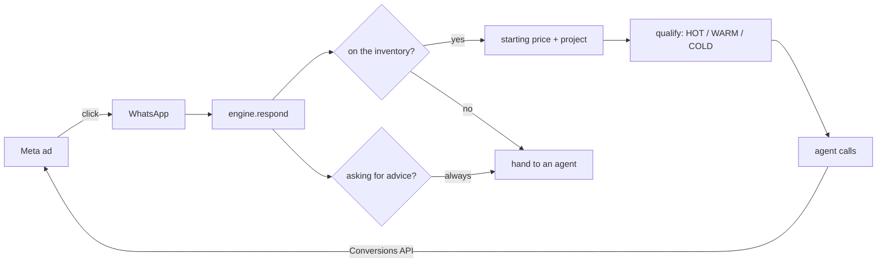

# Sakan

**A WhatsApp AI agent that qualifies property leads for a Dubai brokerage, and the Meta ads automation that feeds it.**

Python 3.11 · FastAPI · Claude / OpenAI · WhatsApp Cloud API · Meta Marketing API · Conversions API · PostgreSQL · Docker

An ad produces a WhatsApp message at 11pm. The agent answers in the buyer's own language, quotes only prices the brokerage actually filed, qualifies the lead, refuses to give investment advice, and hands a graded summary to a human. The booking that human closes is reported back through the Conversions API, so the ads learn to buy customers instead of clicks.

Built on a production agent of mine already running on a live WhatsApp number in another vertical — the transport, model layer, outbound guard and ads automation are the same proven code; what is new here is the part that is genuinely about property.

---

## The loop



Both halves live in one repo deliberately. Split the ads from the agent and the optimiser never learns which campaign produced a buyer rather than a click.

---

## A real conversation

Run against `agencies/demo`, no model configured — every line below comes from the inventory file alone:

```
CUSTOMER: hi
AGENT   : What size are you looking for - studio, 1, 2 or 3 bedroom?

CUSTOMER: 2 bed in JVC how much?
AGENT   : *Binghatti Aurora*, Jumeirah Village Circle — 2 bed from *AED 1,450,000*
          *Belgravia Heights III*, Jumeirah Village Circle — 2 bed from *AED 1,850,000*
          Would you like an agent to send the current availability?

CUSTOMER: whats the payment plan
AGENT   : *Binghatti Aurora* — 70/30 - 70% during construction, 30% on handover

CUSTOMER: and in Palm Jumeirah?
AGENT   : We don't cover that one. Which area did you have in mind -
          Business Bay, Dubai Hills Estate, Jumeirah Village Circle?

CUSTOMER: what are the DLD fees?
AGENT   : Dld Transfer: 4% of the purchase price, plus AED 580 admin
          Agency Commission: 2% of the purchase price
          Mortgage Registration: 0.25% of the loan amount

CUSTOMER: is it a good investment? roi?
AGENT   : That's a conversation worth having properly - one of our agents will
          call you and go through the numbers.          [handover: advice]

CUSTOMER: budget 1.5m, buying this month, cash

TO THE SALES FLOOR:
[HOT] New lead - 2 bed, JVC, AED 1.5m, investment, cash (buying now, cash)
```

---

## The two rules that make it usable in Dubai

**1. A price cannot be invented.** `inventory.py` only ever reads `agencies/<id>/inventory.yaml`. The outbound guard holds a set of every number the facts support, and a reply carrying anything else never leaves the process — it becomes a handover instead. A buyer repeats your number to their bank; an invented one is the brokerage's problem, not the model's.

The tests run this against a composer that answers *"around AED 1,250,000 and you'll see 9% rental yield, prices are going up fast"* on every single turn, and assert the customer sees none of it.

**2. No investment advice. Ever.** *"Is JVC a good investment?"*, *"what ROI will I get?"*, *"will prices go up?"* — always a human. This is checked **before** the price lookup, so an ROI question hiding inside a price question still routes to a person. That is RERA exposure, not a nicety.

Two more that matter less but bite often:

**Another area's prices are never offered as this one's.** Say "2 bed in JVC", then "and in Palm Jumeirah?", and a naive agent reuses the sticky area and quotes JVC numbers for the Palm. This one notices it was handed a place it does not cover and asks.

**The latest statement wins where it should.** Someone who asked about mortgages earlier and says "cash" now is a cash buyer. An agent ringing them about financing has wasted the call.

---

## Qualification

Five signals, read greedily out of whatever the customer volunteers — *"looking for a 2 bed in JVC around 1.5m to rent out, cash, asap"* fills all of them in one message, and asking again for something they just said is the fastest way to lose the chat.

| | |
|---|---|
| **budget** | `1.5m`, `800k`, `1,200,000`, `2 million` |
| **beds** | `2bed`, `2BHK`, `2br`, `studio`, `3-bedroom`, `غرفتين` |
| **area** | name or initials — `JVC`, `Dubai Hills` |
| **timeline** | the strongest predictor of whether it closes |
| **purpose** | to live in, or to invest — changes everything an agent says |

Grading is deliberately dull, because a score the sales floor cannot predict is one they stop trusting, and a router nobody trusts is bypassed within a week. Every grade carries its reason:

```
[HOT]  Ahmed - 2 bed, JVC, AED 1.5m, investment, cash (buying now, cash)
[WARM] New lead - 3 bed, AED 3.0m (exploring, but a real budget)
[COLD] New lead - 2 bed, JVC, AED 0.9m, investment (just looking)
```

Questions come in the order that gets a reply. Budget first is tempting for a sales floor and wrong for a customer — it reads as a credit check before hello. What they want comes first.

---

## The ads layer

`app/ads/` — Meta Marketing API and Conversions API.

```bash
python -m app.ads.cli check                                 # token, accounts, page
python -m app.ads.cli build-campaign --name "JVC buyers"    # PAUSED + creative test
python -m app.ads.cli build-campaign --destination WHATSAPP # click opens a chat
python -m app.ads.cli report --days 7 --level adset
python -m app.ads.cli rules --target-cpl 50                 # dry run
python -m app.ads.cli send-event --event lead --phone +9715xxxxxxx
```

- **Nothing is created active.** Campaigns, ad sets and ads are written `PAUSED` with no override. Activating is a separate call that logs a warning. An automation able to create a live campaign is one bad loop away from spending a month's budget in an afternoon.
- **Budgets are minor units, checked.** A float raises `TypeError` — `50.0` means AED 50 to a person and AED 0.50 to Meta.
- **Deciding is separate from doing.** `rules.evaluate` is pure; `rules.apply` defaults to a dry run, needs a minimum sample before forming an opinion, and cannot move a budget more than one bounded step.
- **PII is hashed before it leaves**, with no flag to skip it, and `event_id` is always set so the pixel and the server deduplicate. Without that, every conversion seen twice halves the reported cost per lead and the budget rules act on a fiction.
- **Retries are selective.** Meta answers a rate limit and your own malformed request with the same HTTP 400; only documented transient codes are retried.

Full architecture, credentials handling and runbook: [docs/ADS.md](docs/ADS.md).

---

## What it remembers

Three things, all in PostgreSQL (SQLite in the tests, a `DATABASE_URL` change and nothing else):

**The lead**, unique on agency and WhatsApp number — a buyer who messaged on Tuesday and again on Friday is one lead, not two. Asking a returning buyer for their budget a second time is the clearest possible signal that nobody is really listening.

**The conversation**, which is the model's memory and the audit trail at once. When a buyer disputes what they were quoted, that table is the answer. The provider's own message id is a unique column, because Meta redelivers anything it did not get a prompt 200 for — without it, a slow reply becomes a customer answered three times.

**The spend**, one row per conversation per day. A cap that resets on deploy is not a cap.

One inbound message is one transaction. A reply that went out while the lead update rolled back is the kind of inconsistency nobody finds until a customer points at it.

## Background jobs

Both exist because of the same failure: a lead answered perfectly, then left sitting.

- **Chase unclaimed hot leads**, every 30 minutes. Somebody said "cash, this month" at 9pm and no human has picked it up two hours later. The expensive mistake in a brokerage is not a bad reply, it is a good lead going cold while everyone assumes somebody else called. A lead is marked only once the nudge is actually sent, so a failed send retries instead of being silently dropped.
- **The evening summary** at 6pm: what came in, what is still unclaimed, what the month has cost.

APScheduler in-process, which suits one box. On more than one they move to a worker with a lock — two instances both sending the evening summary is the obvious first bug, so it is written down rather than discovered.

## What it costs to run

An agent that answers every message is a variable cost on every message, and the bill surprises you in two ways: one runaway thread, or a quiet drift upward that no single reply makes visible.

Every model call is metered where it is made, attributed to the conversation that caused it, and checked against three ceilings **before** the call — a ceiling enforced afterwards is a report, not a cap. Going over is not an error; it hands the customer to a human, the same as anything else the agent cannot do safely.

```
reply 1: $0.00780   running $0.0078
reply 2: $0.00780   running $0.0156
reply 3: $0.00780   running $0.0234
reply 4: REFUSED → usd per conversation today (0.0234 of 0.02) → handover
```

`GET /cost` returns the month, the cost per call and the ten costliest conversations, with the numbers redacted to their last four digits. `GET /health` carries the running month total, so spend is visible without opening a dashboard.

An unknown model bills at the **highest** rate we know rather than at zero — a model that reports as free is how an overrun goes unnoticed. Prices are data, overridable with `LLM_PRICES_JSON`, because a provider's price list changes without asking us.

## Tests

```
106 tests · model and Meta stubbed throughout · no network
.venv/Scripts/python -m pytest tests/test_property.py tests/test_ads.py -q
```

They assert the guarantees, not the happy path: that an invented price never reaches a customer, that an ROI question is always a handover, that a broken model degrades to "an agent will call you" rather than to a number, that one area's prices are never served as another's, that a dry run touches nothing, and that a token never reaches a log line.

Four of them were written before the code and caught four real bugs on the first run — `3-bedroom` not parsing, Palm Jumeirah getting JVC prices, `view` not matching a viewing request, and DLD fees demanding a bedroom count before answering.

---

## Layout

```
app/property/
  inventory.py   price retrieval, never generation. Parses beds/area/budget as people type them.
  qualify.py     the five signals, the next question, the grade and its reason
  engine.py      one message in, one reply out
app/db.py        the schema - agencies, leads, messages, spend. Every row tenant-scoped.
app/store.py     the questions the agent asks of it, in one place
app/cost.py      token metering, per-conversation and monthly caps, the spend report
app/jobs.py      chase unclaimed hot leads; the evening summary
app/ads/
  client.py      the only thing that speaks HTTP to Meta
  campaigns.py   campaign -> ad set -> creative -> ad. All PAUSED.
  insights.py    reporting. Real cost per lead.
  rules.py       budget rules. evaluate() pure, apply() dry by default.
  capi.py        Conversions API. Hashed, deduplicated.
app/              main.py, whatsapp.py, llm.py, guard.py, config.py - shared, domain-free
agencies/demo/    inventory.yaml - projects, prices, handover, payment plans, DLD numbers, fees
prompts/          every model prompt is a file, not a string in the code
```

## Running it

```bash
python -m venv .venv && .venv/Scripts/pip install -r requirements.txt
cp .env.example .env            # WhatsApp + model keys
cp .env.ads.example .env.ads    # Meta ads credentials
uvicorn app.main:app --reload --port 8123
```

Or `docker compose up --build` for the app plus PostgreSQL.

## Not built yet

- Lead Ads form ingestion (`leadgen` webhook) — a form submission landing straight in the agent's queue
- CRM write-back. The grade is produced; pushing it into a CRM is an integration, not a feature.
- Attribution to real revenue — `Schedule` is reported, but value comes from the caller rather than a closed deal
